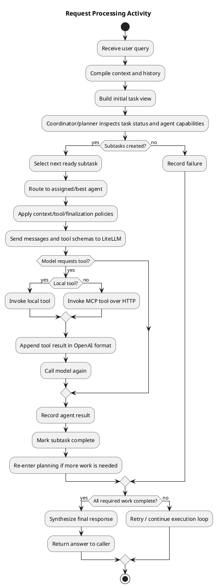

# Activity Diagram

```plantuml
@startuml
title Request Processing Activity

start
:Receive user query;
:Compile context and history;
:Build initial task view;
:Coordinator/planner inspects task status and agent capabilities;

if (Subtasks created?) then (yes)
  :Select next ready subtask;
  :Route to assigned/best agent;
  :Apply context/tool/finalization policies;
  :Send messages and tool schemas to LiteLLM;

  if (Model requests tool?) then (yes)
    if (Local tool?) then (yes)
      :Invoke local tool;
    else (no)
      :Invoke MCP tool over HTTP;
    endif
    :Append tool result in OpenAI format;
    :Call model again;
  endif

  :Record agent result;
  :Mark subtask complete;
  :Re-enter planning if more work is needed;
else (no)
  :Record failure;
endif

if (All required work complete?) then (yes)
  :Synthesize final response;
  :Return answer to caller;
else (no)
  :Retry / continue execution loop;
endif

stop
@enduml
```
