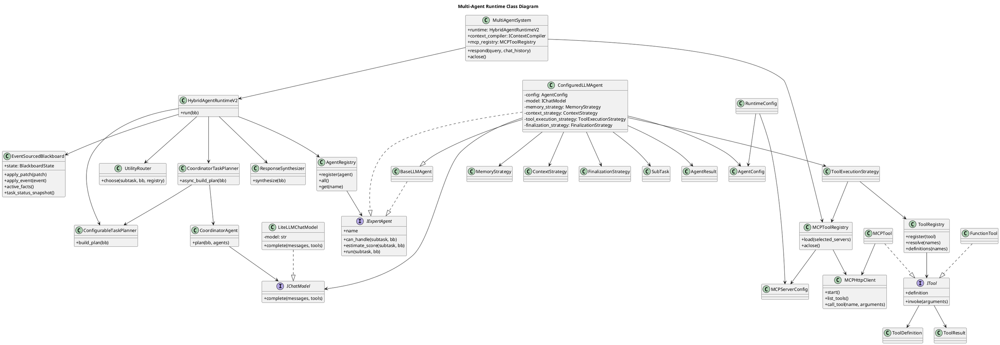

# Class Diagram

```plantuml
@startuml
title Multi-Agent Runtime Class Diagram

skinparam classAttributeIconSize 0

class MultiAgentSystem {
  +runtime: HybridAgentRuntimeV2
  +context_compiler: IContextCompiler
  +mcp_registry: MCPToolRegistry
  +respond(query, chat_history)
  +aclose()
}

class HybridAgentRuntimeV2 {
  +run(bb)
}

class CoordinatorAgent {
  +plan(bb, agents)
}

class EventSourcedBlackboard {
  +state: BlackboardState
  +apply_patch(patch)
  +apply_event(event)
  +active_facts()
  +task_status_snapshot()
}

class AgentRegistry {
  +register(agent)
  +all()
  +get(name)
}

class UtilityRouter {
  +choose(subtask, bb, registry)
}

interface IExpertAgent {
  +name
  +can_handle(subtask, bb)
  +estimate_score(subtask, bb)
  +run(subtask, bb)
}

class ConfiguredLLMAgent {
  -config: AgentConfig
  -model: IChatModel
  -memory_strategy: MemoryStrategy
  -context_strategy: ContextStrategy
  -tool_execution_strategy: ToolExecutionStrategy
  -finalization_strategy: FinalizationStrategy
}

class BaseLLMAgent
class MemoryStrategy
class ContextStrategy
class ToolExecutionStrategy
class FinalizationStrategy

interface IChatModel {
  +complete(messages, tools)
}

class LiteLLMChatModel {
  -model: str
  +complete(messages, tools)
}

class ToolRegistry {
  +register(tool)
  +resolve(names)
  +definitions(names)
}

interface ITool {
  +definition
  +invoke(arguments)
}

class FunctionTool

class MCPToolRegistry {
  +load(selected_servers)
  +aclose()
}

class MCPHttpClient {
  +start()
  +list_tools()
  +call_tool(name, arguments)
}

class MCPTool

class ConfigurableTaskPlanner {
  +build_plan(bb)
}

class CoordinatorTaskPlanner {
  +async_build_plan(bb)
}

class ResponseSynthesizer {
  +synthesize(bb)
}

class AgentConfig
class RuntimeConfig
class MCPServerConfig
class ToolDefinition
class ToolResult
class SubTask
class AgentResult

MultiAgentSystem --> HybridAgentRuntimeV2
MultiAgentSystem --> MCPToolRegistry
HybridAgentRuntimeV2 --> EventSourcedBlackboard
HybridAgentRuntimeV2 --> AgentRegistry
HybridAgentRuntimeV2 --> UtilityRouter
HybridAgentRuntimeV2 --> ConfigurableTaskPlanner
HybridAgentRuntimeV2 --> CoordinatorTaskPlanner
HybridAgentRuntimeV2 --> ResponseSynthesizer

AgentRegistry --> IExpertAgent
BaseLLMAgent ..|> IExpertAgent
ConfiguredLLMAgent ..|> IExpertAgent
ConfiguredLLMAgent --|> BaseLLMAgent
CoordinatorTaskPlanner --> CoordinatorAgent
CoordinatorAgent --> IChatModel
CoordinatorTaskPlanner --> ConfigurableTaskPlanner
ConfiguredLLMAgent --> AgentConfig
ConfiguredLLMAgent --> IChatModel
ConfiguredLLMAgent --> MemoryStrategy
ConfiguredLLMAgent --> ContextStrategy
ConfiguredLLMAgent --> ToolExecutionStrategy
ConfiguredLLMAgent --> FinalizationStrategy
ConfiguredLLMAgent --> AgentResult
ConfiguredLLMAgent --> SubTask
ToolExecutionStrategy --> ToolRegistry
ToolExecutionStrategy --> MCPToolRegistry

LiteLLMChatModel ..|> IChatModel

ToolRegistry --> ITool
FunctionTool ..|> ITool
ITool --> ToolDefinition
ITool --> ToolResult

MCPToolRegistry --> MCPServerConfig
MCPToolRegistry --> MCPHttpClient
MCPTool ..|> ITool
MCPTool --> MCPHttpClient

RuntimeConfig --> AgentConfig
RuntimeConfig --> MCPServerConfig

@enduml
```
