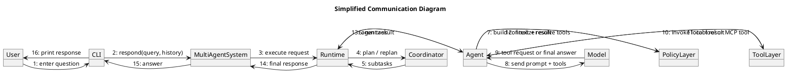

# Communication Diagram

```plantuml
@startuml
title Simplified Communication Diagram

object User
object CLI
object MultiAgentSystem
object Runtime
object Coordinator
object Agent
object Model
object PolicyLayer
object ToolLayer

User -> CLI : 1: enter question
CLI -> MultiAgentSystem : 2: respond(query, history)
MultiAgentSystem -> Runtime : 3: execute request
Runtime -> Coordinator : 4: plan / replan
Coordinator -> Runtime : 5: subtasks
Runtime -> Agent : 6: run task
Agent -> PolicyLayer : 7: build context + resolve tools
Agent -> Model : 8: send prompt + tools
Model -> Agent : 9: tool request or final answer
Agent -> ToolLayer : 10: invoke local tool or MCP tool
ToolLayer -> Agent : 11: tool result
Agent -> PolicyLayer : 12: finalize result
Agent -> Runtime : 13: agent result
Runtime -> MultiAgentSystem : 14: final response
MultiAgentSystem -> CLI : 15: answer
CLI -> User : 16: print response

@enduml
```
