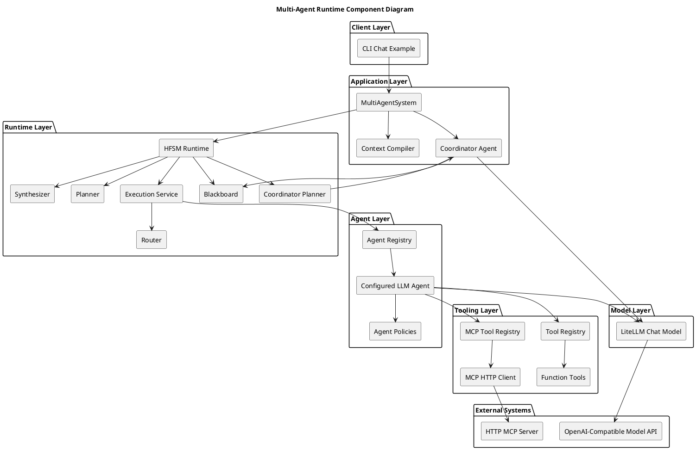

# Component Diagram

```plantuml
@startuml
title Multi-Agent Runtime Component Diagram

skinparam componentStyle rectangle

package "Client Layer" {
  [CLI Chat Example]
}

package "Application Layer" {
  [MultiAgentSystem]
  [Context Compiler]
  [Coordinator Agent]
}

package "Runtime Layer" {
  [HFSM Runtime]
  [Planner]
  [Coordinator Planner]
  [Execution Service]
  [Router]
  [Synthesizer]
  [Blackboard]
}

package "Agent Layer" {
  [Configured LLM Agent]
  [Agent Policies]
  [Agent Registry]
}

package "Model Layer" {
  [LiteLLM Chat Model]
}

package "Tooling Layer" {
  [Tool Registry]
  [Function Tools]
  [MCP Tool Registry]
  [MCP HTTP Client]
}

package "External Systems" {
  [OpenAI-Compatible Model API]
  [HTTP MCP Server]
}

[CLI Chat Example] --> [MultiAgentSystem]
[MultiAgentSystem] --> [Context Compiler]
[MultiAgentSystem] --> [Coordinator Agent]
[MultiAgentSystem] --> [HFSM Runtime]

[HFSM Runtime] --> [Planner]
[HFSM Runtime] --> [Coordinator Planner]
[HFSM Runtime] --> [Execution Service]
[HFSM Runtime] --> [Synthesizer]
[HFSM Runtime] --> [Blackboard]

[Coordinator Planner] --> [Coordinator Agent]
[Coordinator Agent] --> [LiteLLM Chat Model]
[Coordinator Agent] --> [Blackboard]
[Execution Service] --> [Router]
[Execution Service] --> [Agent Registry]
[Agent Registry] --> [Configured LLM Agent]

[Configured LLM Agent] --> [LiteLLM Chat Model]
[Configured LLM Agent] --> [Agent Policies]
[Configured LLM Agent] --> [Tool Registry]
[Configured LLM Agent] --> [MCP Tool Registry]

[Tool Registry] --> [Function Tools]
[MCP Tool Registry] --> [MCP HTTP Client]

[LiteLLM Chat Model] --> [OpenAI-Compatible Model API]
[MCP HTTP Client] --> [HTTP MCP Server]

@enduml
```
