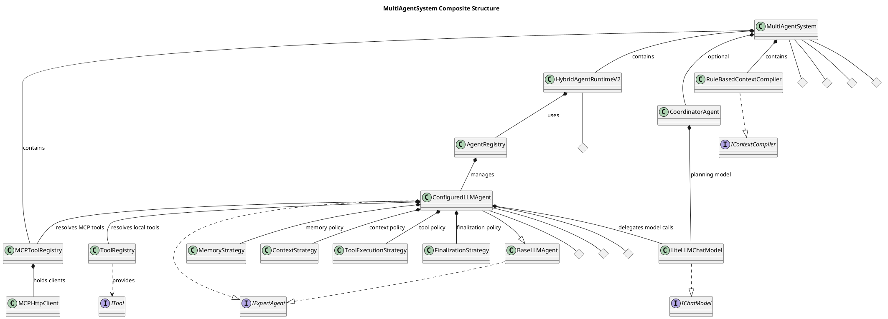

# Composite Structure Diagram

```plantuml
@startuml
title MultiAgentSystem Composite Structure

skinparam componentStyle uml2

class MultiAgentSystem {
}

class HybridAgentRuntimeV2
class RuleBasedContextCompiler
class CoordinatorAgent
class MCPToolRegistry
class AgentRegistry
class BaseLLMAgent
class ConfiguredLLMAgent
class LiteLLMChatModel
class ToolRegistry
class MCPHttpClient
class MemoryStrategy
class ContextStrategy
class ToolExecutionStrategy
class FinalizationStrategy

interface "IContextCompiler" as IContextCompiler
interface "IExpertAgent" as IExpertAgent
interface "IChatModel" as IChatModel
interface "ITool" as ITool

diamond "runtime" as runtime_port
diamond "compiler" as compiler_port
diamond "coordinator" as coordinator_port
diamond "mcp" as mcp_port
diamond "agents" as agents_port
diamond "model" as model_port
diamond "tools" as tools_port
diamond "policies" as policies_port

MultiAgentSystem *-- HybridAgentRuntimeV2 : contains
MultiAgentSystem *-- RuleBasedContextCompiler : contains
MultiAgentSystem *-- CoordinatorAgent : optional
MultiAgentSystem *-- MCPToolRegistry : contains

RuleBasedContextCompiler ..|> IContextCompiler
BaseLLMAgent ..|> IExpertAgent
ConfiguredLLMAgent ..|> IExpertAgent
ConfiguredLLMAgent --|> BaseLLMAgent
LiteLLMChatModel ..|> IChatModel

HybridAgentRuntimeV2 *-- AgentRegistry : uses
AgentRegistry *-- ConfiguredLLMAgent : manages

ConfiguredLLMAgent *-- LiteLLMChatModel : delegates model calls
ConfiguredLLMAgent *-- MemoryStrategy : memory policy
ConfiguredLLMAgent *-- ContextStrategy : context policy
ConfiguredLLMAgent *-- ToolExecutionStrategy : tool policy
ConfiguredLLMAgent *-- FinalizationStrategy : finalization policy
ConfiguredLLMAgent *-- ToolRegistry : resolves local tools
ConfiguredLLMAgent *-- MCPToolRegistry : resolves MCP tools
CoordinatorAgent *-- LiteLLMChatModel : planning model
MCPToolRegistry *-- MCPHttpClient : holds clients

ToolRegistry ..> ITool : provides

MultiAgentSystem -- runtime_port
MultiAgentSystem -- compiler_port
MultiAgentSystem -- coordinator_port
MultiAgentSystem -- mcp_port
HybridAgentRuntimeV2 -- agents_port
ConfiguredLLMAgent -- model_port
ConfiguredLLMAgent -- tools_port
ConfiguredLLMAgent -- policies_port

@enduml
```
