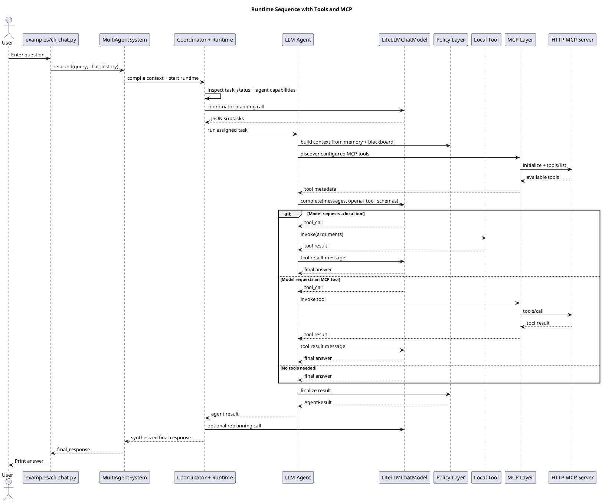

# Detailed Sequence Diagram

```plantuml
@startuml
title Runtime Sequence with Tools and MCP

actor User
participant "examples/cli_chat.py" as CLI
participant "MultiAgentSystem" as System
participant "Coordinator + Runtime" as Runtime
participant "LLM Agent" as Agent
participant "LiteLLMChatModel" as LiteLLM
participant "Policy Layer" as Policies
participant "Local Tool" as LocalTool
participant "MCP Layer" as MCP
participant "HTTP MCP Server" as MCPServer

User -> CLI: Enter question
CLI -> System: respond(query, chat_history)
System -> Runtime: compile context + start runtime
Runtime -> Runtime: inspect task_status + agent capabilities
Runtime -> LiteLLM: coordinator planning call
LiteLLM --> Runtime: JSON subtasks
Runtime -> Agent: run assigned task

Agent -> Policies: build context from memory + blackboard
Agent -> MCP: discover configured MCP tools
MCP -> MCPServer: initialize + tools/list
MCPServer --> MCP: available tools
MCP --> Agent: tool metadata

Agent -> LiteLLM: complete(messages, openai_tool_schemas)
alt Model requests a local tool
  LiteLLM --> Agent: tool_call
  Agent -> LocalTool: invoke(arguments)
  LocalTool --> Agent: tool result
  Agent -> LiteLLM: tool result message
  LiteLLM --> Agent: final answer
else Model requests an MCP tool
  LiteLLM --> Agent: tool_call
  Agent -> MCP: invoke tool
  MCP -> MCPServer: tools/call
  MCPServer --> MCP: tool result
  MCP --> Agent: tool result
  Agent -> LiteLLM: tool result message
  LiteLLM --> Agent: final answer
else No tools needed
  LiteLLM --> Agent: final answer
end

Agent -> Policies: finalize result
Policies --> Agent: AgentResult
Agent --> Runtime: agent result
Runtime -> LiteLLM: optional replanning call
Runtime --> System: synthesized final response
System --> CLI: final_response
CLI --> User: Print answer

@enduml
```
