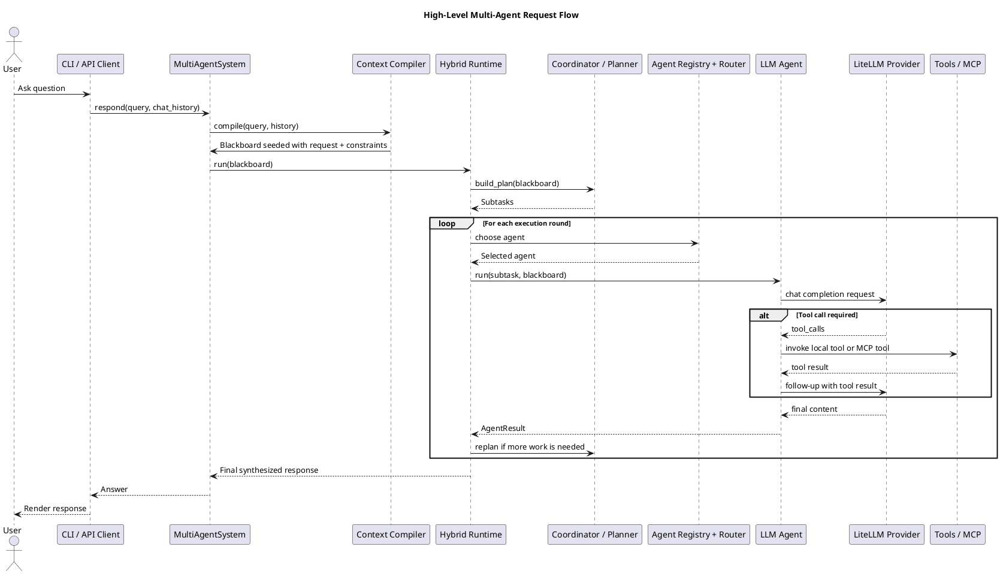

# High-Level Sequence Diagram

```plantuml
@startuml
title High-Level Multi-Agent Request Flow

actor User
participant "CLI / API Client" as Client
participant "MultiAgentSystem" as System
participant "Context Compiler" as Compiler
participant "Hybrid Runtime" as Runtime
participant "Coordinator / Planner" as Planner
participant "Agent Registry + Router" as Router
participant "LLM Agent" as Agent
participant "LiteLLM Provider" as Model
participant "Tools / MCP" as Tools

User -> Client: Ask question
Client -> System: respond(query, chat_history)
System -> Compiler: compile(query, history)
Compiler -> System: Blackboard seeded with request + constraints
System -> Runtime: run(blackboard)

Runtime -> Planner: build_plan(blackboard)
Planner --> Runtime: Subtasks

loop For each execution round
  Runtime -> Router: choose agent
  Router --> Runtime: Selected agent
  Runtime -> Agent: run(subtask, blackboard)
  Agent -> Model: chat completion request
  alt Tool call required
    Model --> Agent: tool_calls
    Agent -> Tools: invoke local tool or MCP tool
    Tools --> Agent: tool result
    Agent -> Model: follow-up with tool result
  end
  Model --> Agent: final content
  Agent --> Runtime: AgentResult
  Runtime -> Planner: replan if more work is needed
end

Runtime --> System: Final synthesized response
System --> Client: Answer
Client --> User: Render response

@enduml
```
