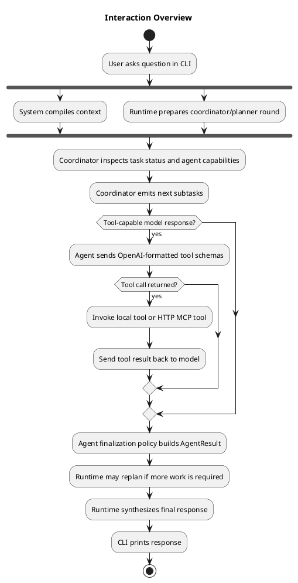

# Interaction Diagram

```plantuml
@startuml
title Interaction Overview

start

:User asks question in CLI;

fork
  :System compiles context;
fork again
  :Runtime prepares coordinator/planner round;
end fork

:Coordinator inspects task status and agent capabilities;
:Coordinator emits next subtasks;

if (Tool-capable model response?) then (yes)
  :Agent sends OpenAI-formatted tool schemas;
  if (Tool call returned?) then (yes)
    :Invoke local tool or HTTP MCP tool;
    :Send tool result back to model;
  endif
endif

:Agent finalization policy builds AgentResult;
:Runtime may replan if more work is required;
:Runtime synthesizes final response;
:CLI prints response;

stop
@enduml
```
