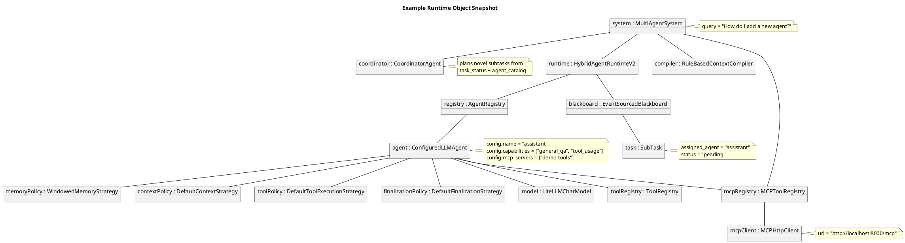

# Object Diagram

```plantuml
@startuml
title Example Runtime Object Snapshot

object "system : MultiAgentSystem" as system
object "runtime : HybridAgentRuntimeV2" as runtime
object "compiler : RuleBasedContextCompiler" as compiler
object "coordinator : CoordinatorAgent" as coordinator
object "mcpRegistry : MCPToolRegistry" as mcpRegistry
object "registry : AgentRegistry" as registry
object "agent : ConfiguredLLMAgent" as agent
object "memoryPolicy : WindowedMemoryStrategy" as memoryPolicy
object "contextPolicy : DefaultContextStrategy" as contextPolicy
object "toolPolicy : DefaultToolExecutionStrategy" as toolPolicy
object "finalizationPolicy : DefaultFinalizationStrategy" as finalizationPolicy
object "model : LiteLLMChatModel" as model
object "toolRegistry : ToolRegistry" as toolRegistry
object "mcpClient : MCPHttpClient" as mcpClient
object "blackboard : EventSourcedBlackboard" as blackboard
object "task : SubTask" as task

system -- runtime
system -- compiler
system -- coordinator
system -- mcpRegistry

runtime -- registry
runtime -- blackboard

registry -- agent
agent -- model
agent -- memoryPolicy
agent -- contextPolicy
agent -- toolPolicy
agent -- finalizationPolicy
agent -- toolRegistry
agent -- mcpRegistry
mcpRegistry -- mcpClient
blackboard -- task

note right of system
query = "How do I add a new agent?"
end note

note right of agent
config.name = "assistant"
config.capabilities = ["general_qa", "tool_usage"]
config.mcp_servers = ["demo-tools"]
end note

note right of mcpClient
url = "http://localhost:8000/mcp"
end note

note right of coordinator
plans novel subtasks from
task_status + agent_catalog
end note

note right of task
assigned_agent = "assistant"
status = "pending"
end note

@enduml
```
