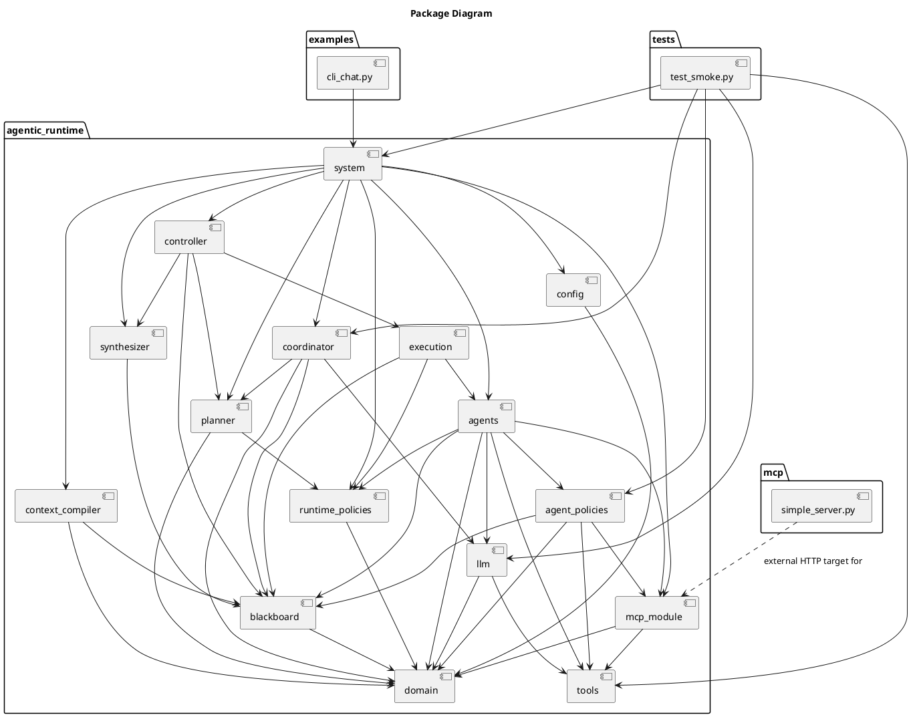

# Package Diagram

```plantuml
@startuml
title Package Diagram

package "examples" {
  [cli_chat.py]
}

package "mcp" {
  [simple_server.py]
}

package "agentic_runtime" {
  [system]
  [controller]
  [agents]
  [agent_policies]
  [coordinator]
  [llm]
  [tools]
  [mcp_module]
  [planner]
  [runtime_policies]
  [synthesizer]
  [context_compiler]
  [blackboard]
  [domain]
  [config]
  [execution]
}

package "tests" {
  [test_smoke.py]
}

[cli_chat.py] --> [system]
[simple_server.py] ..> [mcp_module] : external HTTP target for
[test_smoke.py] --> [system]
[test_smoke.py] --> [coordinator]
[test_smoke.py] --> [agent_policies]
[test_smoke.py] --> [tools]
[test_smoke.py] --> [llm]

[system] --> [controller]
[system] --> [agents]
[system] --> [coordinator]
[system] --> [planner]
[system] --> [runtime_policies]
[system] --> [synthesizer]
[system] --> [context_compiler]
[system] --> [config]
[system] --> [mcp_module]

[controller] --> [execution]
[controller] --> [planner]
[controller] --> [synthesizer]
[controller] --> [blackboard]

[coordinator] --> [llm]
[coordinator] --> [planner]
[coordinator] --> [blackboard]
[coordinator] --> [domain]
[agents] --> [llm]
[agents] --> [agent_policies]
[agents] --> [runtime_policies]
[agents] --> [tools]
[agents] --> [mcp_module]
[agents] --> [domain]
[agents] --> [blackboard]

[agent_policies] --> [domain]
[agent_policies] --> [tools]
[agent_policies] --> [mcp_module]
[agent_policies] --> [blackboard]
[planner] --> [domain]
[planner] --> [runtime_policies]
[synthesizer] --> [blackboard]
[context_compiler] --> [blackboard]
[context_compiler] --> [domain]
[execution] --> [agents]
[execution] --> [blackboard]
[execution] --> [runtime_policies]
[runtime_policies] --> [domain]
[blackboard] --> [domain]
[config] --> [domain]
[mcp_module] --> [domain]
[mcp_module] --> [tools]
[llm] --> [domain]
[llm] --> [tools]

@enduml
```
