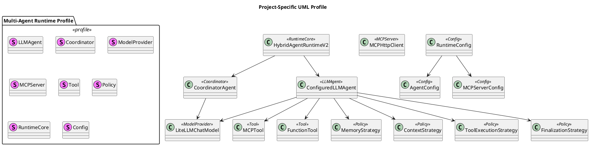

# Profile Diagram

```plantuml
@startuml
title Project-Specific UML Profile

package "Multi-Agent Runtime Profile" <<profile>> {
  stereotype "LLMAgent" as LLMAgent
  stereotype "Coordinator" as Coordinator
  stereotype "ModelProvider" as ModelProvider
  stereotype "MCPServer" as MCPServer
  stereotype "Tool" as Tool
  stereotype "Policy" as Policy
  stereotype "RuntimeCore" as RuntimeCore
  stereotype "Config" as Config
}

class ConfiguredLLMAgent <<LLMAgent>>
class CoordinatorAgent <<Coordinator>>
class LiteLLMChatModel <<ModelProvider>>
class MCPHttpClient <<MCPServer>>
class MCPTool <<Tool>>
class FunctionTool <<Tool>>
class MemoryStrategy <<Policy>>
class ContextStrategy <<Policy>>
class ToolExecutionStrategy <<Policy>>
class FinalizationStrategy <<Policy>>
class HybridAgentRuntimeV2 <<RuntimeCore>>
class AgentConfig <<Config>>
class RuntimeConfig <<Config>>
class MCPServerConfig <<Config>>

ConfiguredLLMAgent --> LiteLLMChatModel
CoordinatorAgent --> LiteLLMChatModel
ConfiguredLLMAgent --> MCPTool
ConfiguredLLMAgent --> FunctionTool
ConfiguredLLMAgent --> MemoryStrategy
ConfiguredLLMAgent --> ContextStrategy
ConfiguredLLMAgent --> ToolExecutionStrategy
ConfiguredLLMAgent --> FinalizationStrategy
HybridAgentRuntimeV2 --> ConfiguredLLMAgent
HybridAgentRuntimeV2 --> CoordinatorAgent
RuntimeConfig --> AgentConfig
RuntimeConfig --> MCPServerConfig

@enduml
```
