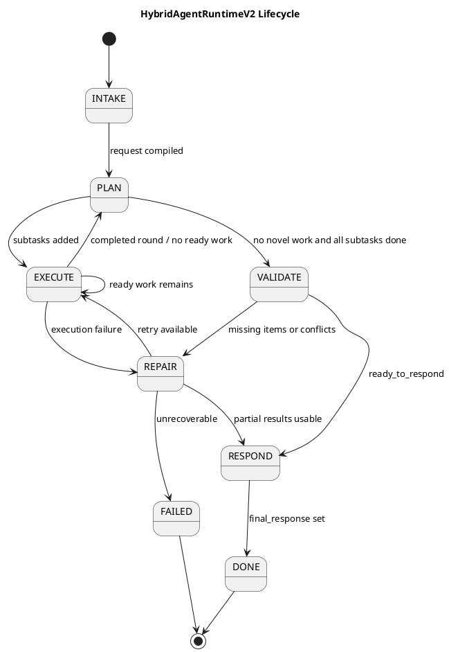

# State Diagram

```plantuml
@startuml
title HybridAgentRuntimeV2 Lifecycle

[*] --> INTAKE

INTAKE --> PLAN : request compiled
PLAN --> EXECUTE : subtasks added

EXECUTE --> EXECUTE : ready work remains
EXECUTE --> PLAN : completed round / no ready work
EXECUTE --> REPAIR : execution failure

REPAIR --> EXECUTE : retry available
REPAIR --> RESPOND : partial results usable
REPAIR --> FAILED : unrecoverable

PLAN --> VALIDATE : no novel work and all subtasks done
VALIDATE --> RESPOND : ready_to_respond
VALIDATE --> REPAIR : missing items or conflicts

RESPOND --> DONE : final_response set

DONE --> [*]
FAILED --> [*]
@enduml
```
