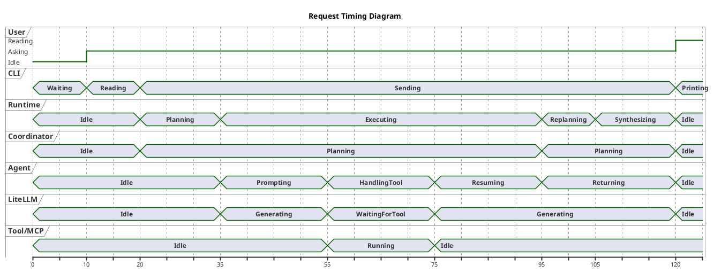

# Timing Diagram

```plantuml
@startuml
title Request Timing Diagram

robust "User" as User
concise "CLI" as CLI
concise "Runtime" as Runtime
concise "Coordinator" as Coordinator
concise "Agent" as Agent
concise "LiteLLM" as LiteLLM
concise "Tool/MCP" as Tooling

@0
User is Idle
CLI is Waiting
Runtime is Idle
Coordinator is Idle
Agent is Idle
LiteLLM is Idle
Tooling is Idle

@10
User is Asking
CLI is Reading

@20
CLI is Sending
Runtime is Planning
Coordinator is Planning

@35
Runtime is Executing
Agent is Prompting
LiteLLM is Generating

@55
LiteLLM is WaitingForTool
Agent is HandlingTool
Tooling is Running

@75
Tooling is Idle
Agent is Resuming
LiteLLM is Generating

@95
Agent is Returning
Runtime is Replanning
Coordinator is Planning

@105
Runtime is Synthesizing

@120
CLI is Printing
User is Reading
Runtime is Idle
Coordinator is Idle
Agent is Idle
LiteLLM is Idle

@enduml
```
